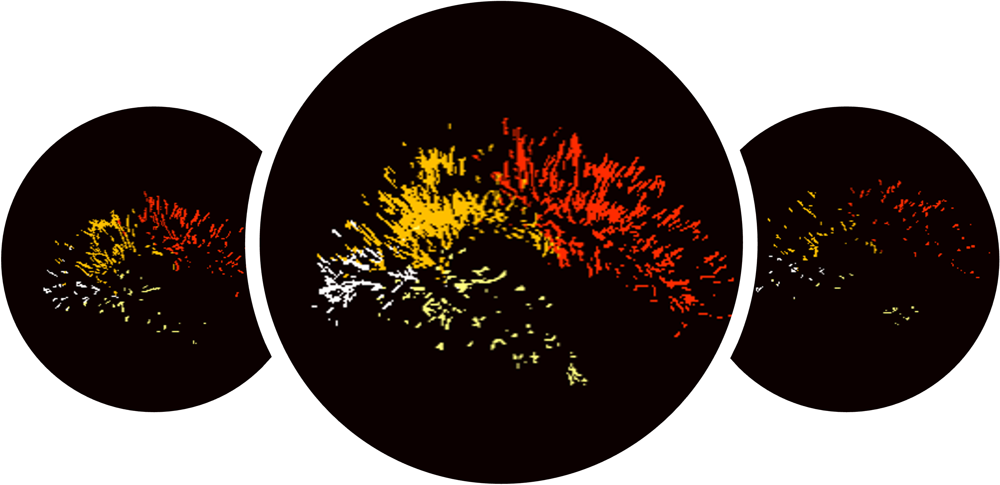

# pvsseg
Automatic perivascular space segmentation on T2-weighted MR images

## Frangi filtering
- Frangi filtering can effectively highlight the perivascular spaces in the white matter. 
- However, since many false positives occur at the tissue interfaces, a predefined ROI mask and additional FP reduction step are often required.
- [Frangi filtering (jupyter notebook)](notebook/example_frangi_T2.ipynb)

## DL-based ROI & PVS segmentation
- A deep learning is an effective way to reduce false positives.
- In our initial method, the DL model was designed in a way that classfies FP from the Frangi filtering result [(HBM 2021)](https://doi.org/10.1002/hbm.25194). 
  - [Inference code](#pvsseg)
- The new version was learned using the PVS and ROI segmentations, both ROI (white matter & deep gray matter regions) and PVS can be simultaneously segmented from T2 input.
  - [Inference code](#pvsseg)
